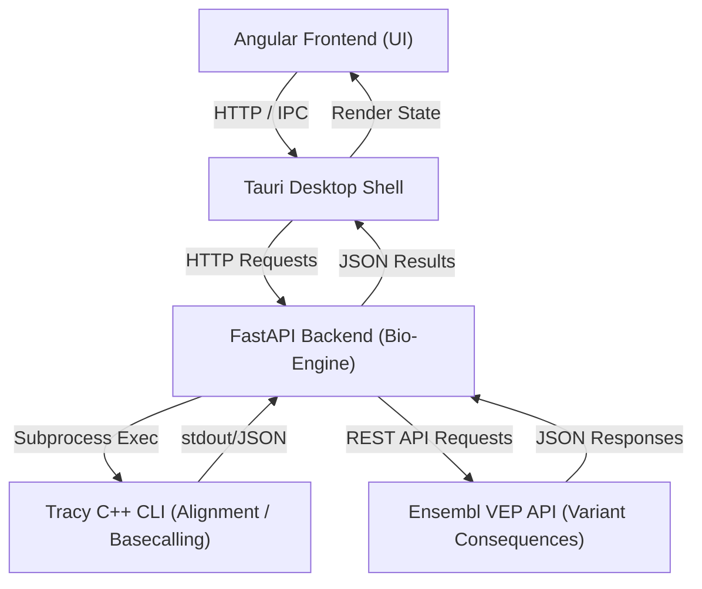

# Bio-Engine Sidecar


The Bio-Engine is an asynchronous backend service designed to handle heavy bioinformatics computational tasks for [PS Analyzer](https://github.com/lagosproject/ps-analyzer). It acts as an integration layer between the main web application and native bioinformatics tools like `tracy`, executing alignments, variant calling, and sequence annotations (HGVS, VEP).

## Architecture & Request Flow

PS Analyzer runs locally with a modular architecture shown below:

### Visual Flow (Mermaid)


### Text Flow (ASCII)
```
[Angular Frontend] (UI components & state)
       │  ▲
       ▼  │ (HTTP / IPC)
[Tauri Desktop App] (Local platform shell)
       │  ▲
       ▼  │ (Local API port 8000)
[FastAPI Backend] (Python Bio-Engine)
       ├───► [Tracy C++ Framework] (Alignment, basecalling, assembly)
       └───► [Ensembl VEP REST API] (Genomic annotation and consequences)
```


## Features
- **Asynchronous Job Management**: Jobs are executed in isolated background threads.
- **Tracy Wrapper**: Advanced DNA sequence decomposition, basecalling, and alignment using the [tracy](https://github.com/gear-genomics/tracy) C++ framework.
- **Variant Recoder & VEP**: Genomic consequence prediction via the Ensembl REST API with built-in batch handling and fallback strategies.
- **HGVS Notation**: Accurate nomenclature mapping powered by Universal Transcript Archive (UTA).

## System Requirements
- Python >= 3.10
- [Tracy CLI API](https://github.com/gear-genomics/tracy): Must be installed and available in the system `PATH`.
- `samtools` and `bgzip`: Needed for auto-indexing very large reference files (>50Kbp).

## Installation

You can install the dependencies via `pip`:

```bash
pip install -r requirements.txt
```

*(Alternatively, use `pip install .` to install via `pyproject.toml`)*

## Running the Engine

Start the FastAPI server via Uvicorn:

```bash
uvicorn main:app --host 127.0.0.1 --port 8000
```
Or simply:
```bash
python main.py
```

## Docker Deployment

The Bio-Engine can be deployed as a standalone API server using Docker. This is ideal for centralized deployments where multiple PS Analyzer instances (or the web-based version) connect to a shared analysis backend.

### Running with Docker

1.  **Build the image**:
    ```bash
    docker build -t bio-engine -f Dockerfile.server .
    ```
2.  **Run the container**:
    ```bash
    docker run -p 8000:8000 -v $(pwd)/data:/app/data bio-engine
    ```

### Purpose of Dockerfiles
- **`Dockerfile.server`**: A production-ready image that includes all necessary bioinformatics tools (`samtools`, `tabix`, `tracy`) and runs the FastAPI server.
- **`Dockerfile`**: Used for building the static binaries (sidecars) for the Tauri desktop application.

## API Documentation
Once the server is running, the Swagger UI is available at `http://127.0.0.1:8000/docs`, where you can explore and interact with the endpoints.

## Development & Refactoring
This codebase follows PEP8 guidelines enforced by `ruff`. To check style errors, run:
```bash
ruff check .
```
And to automatically format your changes:
```bash
ruff format .
```

## Testing

To run the test suite and check code coverage locally:

1. Ensure the `bio-engine` Conda environment is active.
2. Install testing dependencies:
   ```bash
   pip install pytest pytest-cov
   ```
3. Run tests with coverage:
   ```bash
   PYTHONPATH=. pytest
   ```

This will run all tests located in the `tests/` directory (skipping OS-incompatible tests) and generate a coverage summary in the terminal as well as a `coverage.xml` report.

